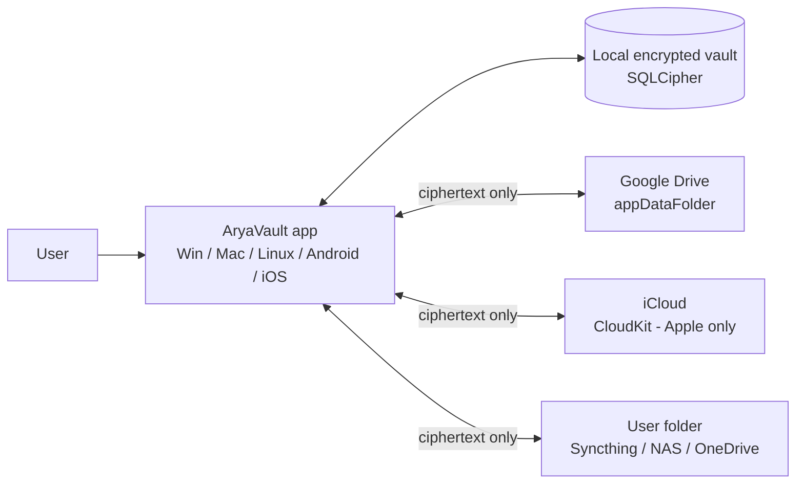
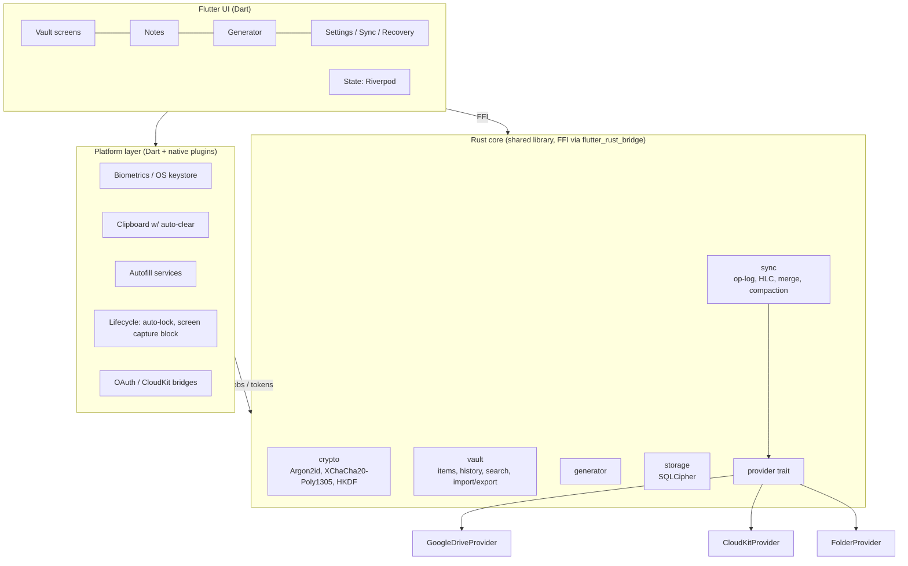
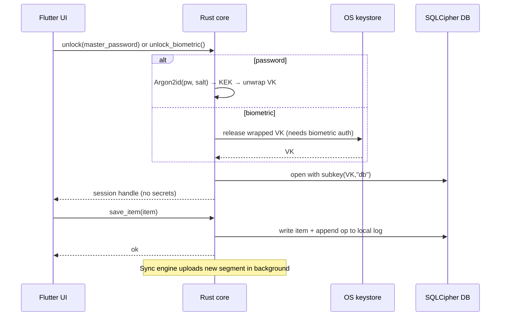
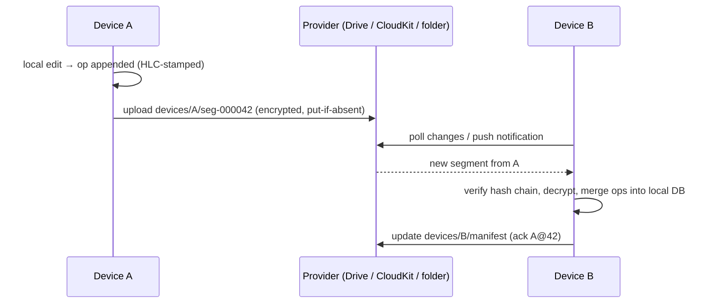

# 02 — Architecture

## 1. Principles
1. **One core, many shells.** All security-sensitive logic lives in a single Rust library. Flutter is a thin UI over it.
2. **Cloud is a dumb blob store.** Providers only store opaque encrypted files. All merging happens on devices.
3. **Single-writer files.** No file is ever written by two devices, so file-sync conflict is impossible by design.
4. **Offline-first.** The local encrypted DB is the source of truth for the UI.
5. **Small trusted surface.** Secrets cross the FFI boundary only when displayed or copied.

## 2. System context



## 3. Container / layer view



## 4. Component responsibilities

| Component | Language | Responsibility | Must NOT |
|---|---|---|---|
| `core-crypto` | Rust | KDF, AEAD, HKDF, key wrap/unwrap, RNG, zeroization | Touch I/O or UI |
| `core-vault` | Rust | Item model, CRUD, history, FTS search, import/export | Talk to network |
| `core-sync` | Rust | Local op-log, segment encode/decode, merge, compaction, manifests | Know provider specifics |
| `core-storage` | Rust | SQLCipher access, migrations | Hold keys beyond session |
| `core-generator` | Rust | Passwords, passphrases, strength estimate | Use non-CSPRNG |
| `providers/*` | Rust (+ native glue) | Implement `SyncProvider` for Drive / CloudKit / folder | Decrypt anything |
| `app` | Dart | UI, navigation, state, i18n | Implement crypto |
| `platform/*` | Dart + Kotlin/Swift/C++ | Keystore, biometrics, clipboard, autofill, lifecycle | Store plaintext secrets |
| `cli` (later) | Rust | Scripting, headless sync, test harness | — |

## 5. Unlock and read/write flow



## 6. Sync flow (overview; details in doc 06)



## 7. Repository layout (monorepo)

```
password-manager/
├─ core/                    # Rust workspace
│  ├─ crates/
│  │  ├─ crypto/
│  │  ├─ vault/
│  │  ├─ storage/
│  │  ├─ sync/
│  │  ├─ generator/
│  │  ├─ providers-folder/
│  │  ├─ providers-gdrive/
│  │  ├─ providers-cloudkit/   # thin; native glue in platform/ios-macos
│  │  ├─ ffi/                  # flutter_rust_bridge surface (API kept minimal)
│  │  └─ cli/
│  └─ testdata/             # KATs, fixtures, golden vault files
├─ app/                     # Flutter app (lib/, test/, integration_test/)
├─ platform/                # native plugins: android/, ios/, macos/, windows/, linux/
├─ docs/
├─ tools/                   # sync simulator, fuzz harnesses, release scripts
└─ .github/workflows/
```

## 8. FFI boundary rules
- API is **coarse-grained** (e.g., `list_items`, `save_item`, `generate_password`) — no exposing raw keys to Dart.
- Secret-bearing return values (e.g., a password) are returned only on explicit user action (reveal/copy) and are zeroed on the Rust side after handoff where possible; Dart holds them as short-lived `Uint8List`s, never `String` where avoidable.
- All parsing of external data (cloud files, imports) happens in Rust and is fuzzed.

## 9. Concurrency model
- Rust core owns one writer task for the DB; reads are concurrent.
- Sync runs on a background task/isolate with exponential backoff; on mobile it additionally uses WorkManager (Android) / BGTaskScheduler (iOS).
- Locking the vault cancels in-flight operations, zeroizes key material, and closes the DB.

## 10. Platform-specific notes
| Platform | Notes |
|---|---|
| Windows | Windows Hello via `UserConsentVerifier` + DPAPI / TPM-backed key; `WDA_EXCLUDEFROMCAPTURE` for screen capture; clipboard history exclusion format |
| macOS | Keychain + `LAContext` (Touch ID); `NSWindow.sharingType = none`; concealed pasteboard type |
| Linux | `libsecret` (Secret Service); no biometrics v1; Flatpak portal for file access |
| Android | Android Keystore (StrongBox if present) with biometric-bound key; `FLAG_SECURE`; `EXTRA_IS_SENSITIVE` on clipboard; AutofillService + Credential Manager |
| iOS | Keychain with `.biometryCurrentSet` access control; app-switcher blur; pasteboard `expirationDate`/`localOnly`; AutofillCredentialProvider extension (App Group shared container; memory-limited so the extension never runs Argon2) |

## 11. Scalability and limits
- Vault target ≤ 20k items, notes ≤ 1 MiB each (hard cap), segment size ≤ 1 MiB, snapshot streamed.
- Compaction keeps cloud storage bounded (doc 06 §9).
