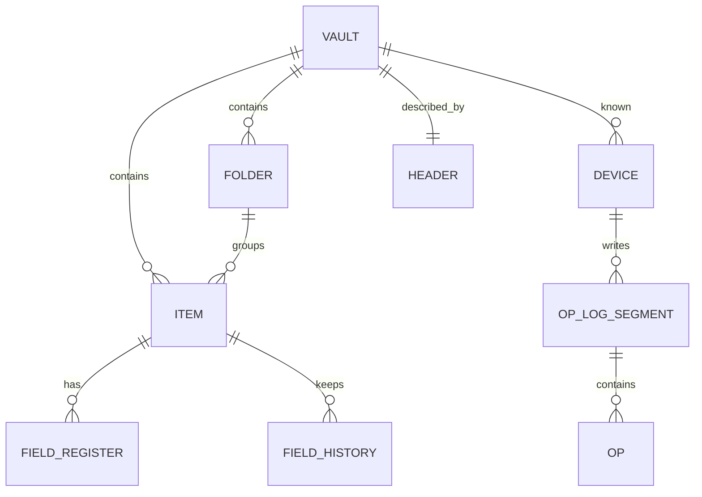

# 05 — Data Model

## 1. Concepts
- **Vault:** one per user per `vault_id`. Contains items, folders, settings.
- **Item:** a typed record. Internally a **map of field registers** (each field is a last-writer-wins register; see doc 06).
- **Field register:** `(key, value, hlc, device_id, base_hlc)`.
- **Op:** a single mutation `set(field)`; deletion/restoration are ops on the `deleted` field.
- **History:** older register values retained for restore.

## 2. Item types and fields

| Type | Standard fields |
|---|---|
| `login` | title, username, password, urls[], totp_seed, notes, custom[] |
| `note` | title, body (Markdown, ≤1 MiB), tags |
| `card` | title, holder, number, expiry, cvv, pin, notes |
| `identity` | title, name parts, email, phone, address, ids, notes |
| `wifi` / `custom` (P2) | arbitrary labeled fields |

Common fields on every item: `id` (UUIDv7), `type`, `folder_id`, `tags[]`, `favorite`, `created_at`, `deleted` (bool, tombstone), `deleted_at`, `schema_version`.

Custom fields: `{ id, label, kind: text|hidden|url|date, value }` stored as individually addressable registers (`custom.<id>.value`, `custom.<id>.label`).

## 3. Identifiers
- Item/folder IDs: UUIDv7 (time-ordered, generated locally; collision-free without coordination).
- Op IDs: `(device_id, seq, index)` — unique and idempotent.
- Device ID: 16 random bytes generated at first launch of the app on that device; stable until app data is erased.

## 4. Conceptual model (ER)



## 5. Local database schema (SQLCipher, inside the encrypted file)

```sql
-- metadata
CREATE TABLE meta (
  key TEXT PRIMARY KEY, value BLOB NOT NULL
);  -- schema_version, vault_id, device_id, epoch, header_version, hlc_state

CREATE TABLE item (
  id BLOB PRIMARY KEY,           -- 16B UUIDv7
  type TEXT NOT NULL,
  folder_id BLOB,
  deleted INTEGER NOT NULL DEFAULT 0,
  deleted_hlc INTEGER,
  updated_hlc INTEGER NOT NULL   -- max of its field hlcs, for sorting
);

CREATE TABLE field (
  item_id BLOB NOT NULL REFERENCES item(id),
  key TEXT NOT NULL,             -- e.g. "title","password","custom.<id>.value"
  value BLOB,                    -- CBOR-encoded value
  hlc INTEGER NOT NULL,          -- 64-bit packed HLC
  device_id BLOB NOT NULL,
  base_hlc INTEGER,              -- hlc of the version the author saw (ancestry graph, doc 06 s5.3)
  PRIMARY KEY (item_id, key)
);

CREATE TABLE field_history (
  item_id BLOB NOT NULL, key TEXT NOT NULL,
  value BLOB, hlc INTEGER NOT NULL, device_id BLOB NOT NULL,
  base_hlc INTEGER,              -- needed to compute concurrent versions at read time
  PRIMARY KEY (item_id, key, hlc, device_id)
);

CREATE TABLE folder (
  id BLOB PRIMARY KEY, name TEXT NOT NULL, parent_id BLOB,
  hlc INTEGER NOT NULL, device_id BLOB NOT NULL, deleted INTEGER NOT NULL DEFAULT 0
);

-- sync state
CREATE TABLE local_op (          -- ops not yet uploaded
  seq INTEGER PRIMARY KEY AUTOINCREMENT,
  item_id BLOB NOT NULL, key TEXT NOT NULL, value BLOB,
  hlc INTEGER NOT NULL, base_hlc INTEGER
);
CREATE TABLE outbox (            -- frozen segments awaiting confirmed upload (doc 06 s6)
  seq INTEGER PRIMARY KEY,       -- this device's segment number
  bytes BLOB NOT NULL,           -- exact encrypted envelope; retries re-send identical bytes
  uploaded INTEGER NOT NULL DEFAULT 0
);
CREATE TABLE manifest_seen (     -- highest manifest counter seen per device (rollback detection)
  device_id BLOB PRIMARY KEY, counter INTEGER NOT NULL
);
CREATE TABLE segment_seen (      -- per remote device
  device_id BLOB NOT NULL, seq INTEGER NOT NULL, hash BLOB NOT NULL,
  applied_at INTEGER NOT NULL, PRIMARY KEY (device_id, seq)
);
CREATE TABLE device (
  device_id BLOB PRIMARY KEY, name TEXT, first_seen INTEGER, last_seen INTEGER, revoked INTEGER DEFAULT 0
);
CREATE TABLE provider_state (    -- cursor tokens, etags (no secrets)
  provider TEXT PRIMARY KEY, cursor TEXT, updated_at INTEGER
);

-- search (decrypted index lives only inside the encrypted DB)
CREATE VIRTUAL TABLE item_fts USING fts5(title, username, urls, notes, tags, content='');
```

Indexes: `item(type,deleted)`, `item(folder_id)`, `field(item_id)`, `field_history(item_id,key)`.

Secrets stored outside the DB (OS keystore only): biometric-wrapped VK, OAuth refresh tokens.

## 6. Encoding
- Canonical **CBOR** (RFC 8949 deterministic encoding) for headers, ops, snapshots, so hashes/AAD are reproducible across implementations.
- Timestamps UTC. HLC packed: 48 bits physical ms, 16 bits counter (device_id is a separate column for tiebreak).

## 7. Deletion semantics
1. Delete = set `deleted=true` (tombstone op). Item moves to Trash.
2. Trash retained **30 days**, then purge: a purge op removes field values but keeps a minimal tombstone `(id, deleted_hlc)` for 180 days so late-arriving devices don't resurrect the item.
3. Tombstones are dropped on compaction only when **both** all known devices have acked a snapshot containing them **and** at least 180 days have passed since deletion (review L6).

## 8. History
- Every overwrite of a field register moves the previous `(value, hlc, device)` into `field_history`.
- Default: keep last 20 versions per field for sensitive fields (`password`, `body`, `totp_seed`), 5 for others; user-adjustable.
- History syncs implicitly through the op-log (all ops are replayed); compaction keeps retained history in snapshots.

## 9. Import / export mapping
| Format | Direction | Notes |
|---|---|---|
| CSV (generic, Chrome, Firefox, Safari) | import/export | Warn on plaintext export |
| Bitwarden JSON | import | Folders, logins, notes, cards, identities, custom fields |
| KeePass KDBX 3/4 | import | Via audited library in Rust (parser fuzzed) |
| AryaVault encrypted JSON | import/export | Password-protected (Argon2id + XChaCha20-Poly1305), documented format |

## 10. Limits
| Item | Limit |
|---|---|
| Field value | 64 KiB (note body 1 MiB) |
| Items | 20,000 target (soft), 100,000 hard |
| Custom fields per item | 100 |
| Tags per item | 50 |
| History per field | 20 |
