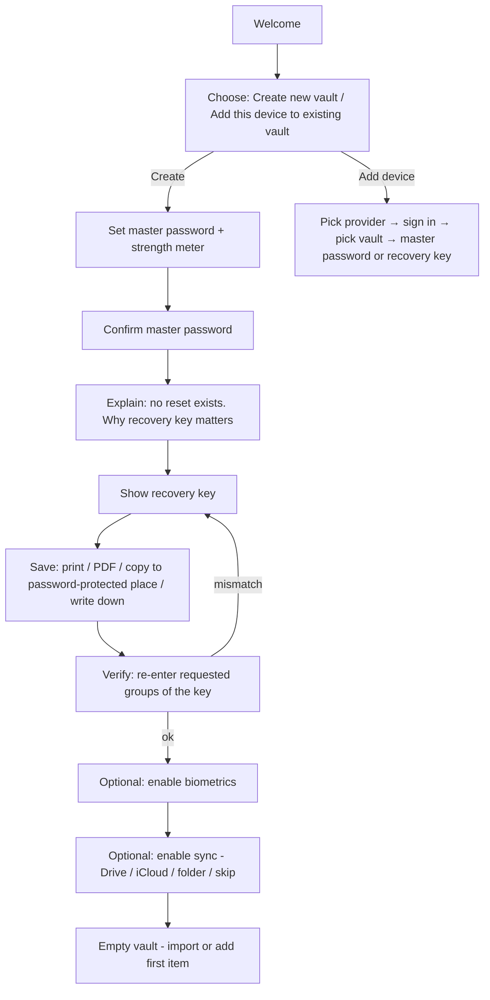

# 07 — UX and Recovery

## 1. Design principles
1. Security by default; no insecure toggles hidden in the first-run path.
2. Be honest about irreversibility (no reset exists) — say it plainly, once, at the right moment.
3. Fast daily path: unlock → search → copy in ≤ 3 interactions.
4. Same mental model on every platform; platform-native affordances (biometrics, share sheets, menu bar).
5. Accessible by default (screen readers, dynamic type, keyboard-only on desktop).

## 2. Information architecture

```
Lock screen
Main
├─ Vault (all items) — search bar always visible
│   ├─ Favorites · Folders · Tags · Trash
│   └─ Item detail / edit
├─ Generator (password / passphrase)
├─ Health (weak, reused, old, missing TOTP)
└─ Settings
    ├─ Security (auto-lock, biometrics, clipboard timeout, master password, recovery key)
    ├─ Sync & backup (provider, status, devices, snapshots, restore)
    ├─ Import / export
    └─ About (version, licenses, audit reports)
```

## 3. Onboarding: create vault



**Hard rule:** the user cannot finish onboarding without passing step H. "Skip" is not offered. (Decision recorded from product review: recovery key is mandatory.)

Copy guidelines for step E (draft):
> "AryaVault can't reset your password — we don't have your data or a server. Your recovery key is the only backup. Store it somewhere safe and separate from this device."

## 4. Unlock flows
| Situation | Flow |
|---|---|
| Normal | Biometric prompt (if enabled) → vault; fall back to master password |
| After reboot / 72 h / 5 bad biometrics | Master password required |
| Master password wrong ×N | Local exponential delay (client-side only; cosmetic against offline attack, noted honestly in docs) |
| Forgot master password | "Use recovery key" → enter key → set new master password → option to rotate recovery key |
| Forgot both | Explanation screen: data is unrecoverable; offer to restore from an *older snapshot if the user remembers an older password*; offer to erase local data and start fresh |

## 5. Recovery key operations (Settings → Security)
- **View/print again:** requires master password; shows the key only once per request.
- **Regenerate:** requires master password; old key stops working immediately; user must confirm saving the new one (same verify step).
- **Reminder:** soft prompt at 7 and 30 days if the user never confirmed re-saving; hidden once "I stored it" is explicitly confirmed with a re-entry check.
- Never offered: "email me my recovery key", "store in cloud".

## 6. Key screens (wireframe-level)

| Screen | Key elements |
|---|---|
| Lock | App icon, biometric button, master password field (reveal toggle), "Use recovery key" link |
| Vault list | Search, type filter chips, sort, item rows (icon, title, username), swipe/hover actions (copy user, copy pass), FAB/“+” |
| Item detail | Masked password with reveal + copy; URL open; TOTP with countdown; custom fields; history; “changed on another device” badge |
| Item edit | Field editors; inline generator; unsaved-change guard |
| Generator | Length slider, toggles, passphrase mode, live entropy, regenerate, copy, “use for new item” |
| Sync status | Provider, last sync, state chip, devices list, “Sync now”, warnings (tamper/clock/quota) |
| Conflict/Changes | List of items where a lost edit exists → compare & restore |
| Snapshots | List with dates/size, pin, restore (preview before apply) |

## 7. Security UX details
- Password fields default masked; reveal auto-hides after 15 s or on lock.
- Clipboard toast: "Copied — clears in 30 s".
- Auto-lock options: immediately, 1, 5 (default), 15, 60 min, on screen lock, on sleep.
- Mobile app-switcher preview blurred; screenshots blocked (toggle for users with accessibility needs, default on).
- Weak master password: block below minimum; warn under 16 chars with passphrase suggestion.
- Sync warnings use plain language: "Another device's data looks incomplete. Your local data is safe. [Details]".

## 8. Platform-specific UX
| Platform | Notes |
|---|---|
| Windows/macOS/Linux | Sidebar + list + detail (three-pane); global shortcut for quick search (opt-in); system tray / menu bar; keyboard navigation; drag-and-drop import |
| Android | Bottom navigation; autofill dialog; biometric prompt; share target to “save login” (P1) |
| iOS | Tab bar; AutoFill extension UI; Face/Touch ID; share extension (P1) |

## 9. Empty, error and edge states
- Empty vault: import / add / generate.
- Offline: banner "Working offline — changes will sync later".
- Sync auth expired: non-blocking banner with re-sign-in.
- Corrupt remote file: quarantined + diagnostic export (no secrets).
- Low RAM for Argon2 profile: explicit explanation and choose-lower-risk guidance (never silent).

## 10. Accessibility and i18n
- All controls labelled; focus order tested with TalkBack/VoiceOver/NVDA.
- Contrast ≥ AA, scalable text, no color-only meaning.
- Strings externalized (ARB); RTL-ready layouts.
- Master password entry supports IME and non-Latin input (NFKD normalization documented).

## 11. Usability test plan (pre-beta)
- Task: create vault & save recovery key (success = verified step passes without help).
- Task: add second device via Drive (time & error rate).
- Task: recover using recovery key after “forgetting” password.
- Task: resolve a changed-on-another-device badge.
