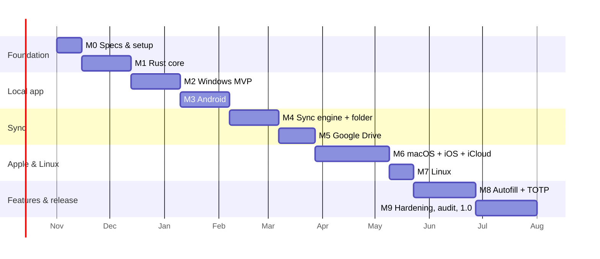

# 10 — Roadmap and Delivery Plan

Estimates assume one experienced full-time developer; halve calendar time with two. Each milestone has **exit criteria** — don't start the next phase until they're met. Platform order: **Windows + Android → macOS + iOS → Linux**.

## Timeline overview

(Dates are illustrative; recompute at kickoff.)

## M0 — Specifications and project setup (1–2 wks)
- Finalize docs 01–12; review crypto & sync specs with a second reviewer (ideally an external cryptographer, informally).
- Choose name, bundle IDs, license (ADR-0009); register Apple Developer ($99/yr) and Google Play ($25 once) accounts; create Google Cloud project for Drive OAuth.
- Repo, CI skeleton, lint/audit gates, CODEOWNERS, DCO bot.
- **Exit:** docs approved; empty CI green on Windows/Linux/macOS runners; golden test vectors file format agreed.

## M1 — Rust core (3–4 wks)
- Crates: crypto, storage, vault, generator; header & envelope formats; recovery key encode/decode; import/export (CSV, Bitwarden).
- CLI test harness for headless vault ops.
- Test vectors, property tests, first fuzz targets, golden files + independent Python decryptor.
- **Exit:** SEC-C* requirements verified; 90%+ coverage in crypto/vault; fuzzers run 1 h clean; benchmarks: Argon2 calibration, 20k-item search < 100 ms.

## M2 — Windows MVP (3–4 wks)
- Flutter shell, FFI bindings, lock screen, onboarding with recovery key verification, vault CRUD, notes, search, generator, health report.
- Windows Hello unlock, clipboard hygiene, capture exclusion, auto-lock, MSIX build (unsigned dev).
- **Exit:** US-01…US-09, US-13, US-15 pass on Windows; usability test of onboarding with 5 users; SEC-A*, SEC-S*, SEC-H01–H03 verified on Windows.

## M3 — Android (3–4 wks)
- Android build, Keystore biometrics, FLAG_SECURE, clipboard sensitive flag, responsive layouts, backup rules.
- **Exit:** same user stories on Android; SEC-* mobile items verified on 3 devices (low/mid/high RAM); Argon2 low-RAM handling validated.
- **Release:** 0.1 alpha (internal testing track + Windows installer).

## M4 — Sync engine + folder provider (4 wks)
- Op-log, HLC, merge, manifests, hash chain, snapshots, compaction, device lifecycle, rebase.
- **Sync simulator** (`tools/sim`): N virtual devices, adversarial provider (delay, reorder, duplicate, truncate, rollback, corrupt).
- Folder provider + conformance suite.
- **Exit:** SEC-Y* verified; 10 000 randomized simulator runs converge; Windows↔Android works over a shared folder (Syncthing).

## M5 — Google Drive (3 wks)
- OAuth (PKCE) on Windows/Android; `drive.appdata` provider; path/ID cache; duplicate-name handling; change feed; backoff; quota handling.
- Sync status UI, devices list, snapshots list, restore, "move sync location".
- **Exit:** conformance suite passes against real Drive; add-device flow < 2 min; token revocation & offline paths tested.
- **Release:** 0.2 beta.

## M6 — macOS + iOS + iCloud (6 wks)
- macOS and iOS builds, Keychain + Touch ID/Face ID, pasteboard policies, app-switcher blur, notarization.
- CloudKit provider (+ push subscriptions), Drive on Apple platforms, iCloud limitation messaging in UI.
- **Exit:** all earlier exit criteria on Apple platforms; cross-ecosystem matrix: Win↔Android↔iOS via Drive, Mac↔iPhone via iCloud.
- **Release:** 0.3 beta (TestFlight).

## M7 — Linux (2 wks)
- libsecret integration, Flatpak/AppImage/deb/rpm, desktop file, portal usage, Wayland/X11 checks.
- **Exit:** manual matrix on Ubuntu LTS, Fedora, Arch (GNOME + KDE).

## M8 — Autofill + TOTP (5 wks)
- Android AutofillService + Credential Manager provider; iOS AutoFill extension (no Argon2 in extension); domain/package matching.
- TOTP generation (RFC 6238) + QR scan; optional desktop browser extension via native messaging (stretch).
- **Exit:** SEC-H07/H08; phishing-matching test suite; 0.4 beta.

## M9 — Hardening, audit, 1.0 (5 wks + audit lead time)
- Fuzz campaigns (24 h+ per target), memory-scrub verification, dependency audit, reproducible-build attempt, accessibility audit, localization pass.
- **External security audit** of crypto, sync, FFI and platform layers; fix all critical/high; publish report.
- Store submissions, signed installers, update docs, website/readme, security contact live.
- **Exit:** SEC-R07; all MUST requirements verified; no open data-loss bugs. **Release 1.0.**

## Post-1.0 backlog
Passkeys (WebAuthn credential provider), file attachments, optional Secret Key (device-held entropy), per-device signatures, CLI release, browser extensions, selective sync, shared vaults (needs a key-sharing design and separate threat model), watch/wearable companion, emergency-access via Shamir-split recovery key (opt-in).

## Risk register
| Risk | Likelihood | Impact | Mitigation |
|---|---|---|---|
| Sync data loss bug | Med | Critical | Simulator + property tests, history, never auto-rollback, snapshots |
| User loses password + recovery key | High (population) | Critical for that user | Mandatory verified recovery key, reminders, honest messaging |
| Rust↔Flutter cross-compile friction | Med | Med | Early spike in M0/M1 on all 5 targets; fallback pure-Dart core |
| Apple review / entitlement delays | Med | Med | Start Apple accounts early; TestFlight earlier than needed |
| Google OAuth policy changes | Low | High | Folder provider as escape hatch; abstraction |
| iOS AutoFill extension memory limits | Med | Med | No Argon2 in extension; keystore-held key |
| Solo-maintainer bus factor / burnout | Med | High | Docs-first, small scope, open source community |
| Audit cost | Med | Med | Budget early; community review; staged audit of crypto crate first |
| Dependency compromise | Low | High | cargo-vet/deny, pinning, minimal deps |

## Pre-M1 spikes (de-risk in M0, ≤ 3 days each)
1. Hello-world Flutter + Rust FFI on Windows and Android (cargo-ndk).
2. SQLCipher bundled build on all five targets.
3. Drive appDataFolder create/list/changes round trip from Rust.
4. CloudKit record create + subscription from Swift, bridged to Rust trait.
