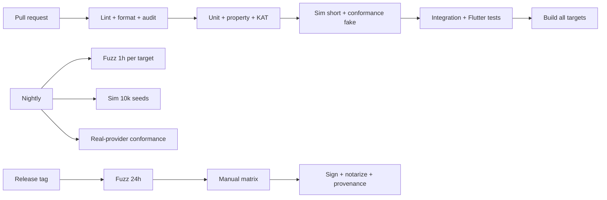

# 11 — Testing Strategy

Goals: **never lose data, never leak secrets, behave identically on every platform.** Sync and crypto get the heaviest investment.

## 1. Test pyramid

| Level | Tooling | Scope | Gate |
|---|---|---|---|
| Unit | `cargo test`, `flutter test` | Pure functions, encoders, KDF, AEAD, generator, HLC | PR |
| Known-answer | RFC vectors, golden files | Crypto primitives & formats | PR |
| Property | `proptest` | Merge laws, codec round-trips, generator uniformity | PR |
| Fuzz | `cargo-fuzz` (libFuzzer) | Every parser of external bytes | Nightly + pre-release 24 h |
| Sync simulation | `tools/sim` | N-device convergence under adversarial storage | PR (short), nightly (long) |
| Provider conformance | Shared suite | Each `SyncProvider` implementation | PR (fake), nightly (real, sandbox accounts) |
| Integration | Rust + temp dirs; Flutter `integration_test` | Create → lock → unlock → edit → sync → restore | PR |
| UI / widget | Flutter golden & widget tests | Screens, a11y semantics | PR |
| Platform manual | Checklists (§9) | Biometrics, clipboard, capture-block, autofill | Pre-release |
| Security review | Threat-model checklist, audit | Whole system | Pre-release / 1.0 |

## 2. Crypto tests
- RFC 9106 Argon2id vectors; XChaCha20-Poly1305 vectors; HKDF RFC 5869 vectors.
- Wrap/unwrap round trips; AAD tamper tests (flip each header field → unwrap must fail).
- NFKD vectors: composed/decomposed accents, Hangul, full-width, emoji — same MK across platforms.
- Nonce uniqueness: 10⁷ draws, no collision (statistical sanity check).
- Zeroization: tests with memory inspection in debug builds (canary patterns).
- **Cross-implementation check:** Python decryptor in `tools/` must open golden vaults produced by the Rust core.

## 3. Sync correctness (the critical part)

### 3.1 Property tests for merge
For arbitrary sets of ops `A`, `B`, `C`:
- Commutative: `merge(A,B) == merge(B,A)`
- Associative: `merge(merge(A,B),C) == merge(A,merge(B,C))`
- Idempotent: `merge(A,A) == A`
- Order-independent application of any permutation/duplication of the same op set yields identical state (including history and conflict copies).
- Tombstone/resurrect semantics hold per doc 06 §5.2.

### 3.2 Simulator
`tools/sim` runs 2–6 virtual devices against an in-memory provider with a programmable adversary:

| Fault | Injected behavior |
|---|---|
| Latency/reorder | Listing and downloads delayed/reordered |
| Duplicates | Same file delivered multiple times; duplicate-name creation (Drive-like) |
| Partial writes | Truncated/corrupt files |
| Withholding | Files hidden from some devices for a time |
| Rollback | Older directory state presented |
| Deletion | Segments removed |
| Clock skew | Per-device offsets (± hours, +days) |
| Crashes | Device killed mid-upload / mid-apply (transaction atomicity) |
| Offline | Device offline for > compaction window → rebase |

**Assertions:** (1) after quiescence all devices converge to identical state; (2) no accepted op is lost unless user-deleted; (3) tampering/rollback is **detected** and local state not overwritten; (4) cloud contains no plaintext (scan for canary strings); (5) compaction never deletes data a live device still needs.

Run: 200 seeds per PR, 10 000 seeds nightly, seeds printed for replay.

### 3.3 Conformance suite (providers)
put_if_absent semantics (incl. concurrent creates), list consistency, get after put, delete idempotency, large file, unicode/odd names (hex only), rate-limit/backoff, cursor/changes behavior, auth-expired → typed error.

## 4. Fuzzing targets
Header parser · envelope parser · segment/snapshot decoder · manifest decoder · CSV importer · Bitwarden JSON importer · KDBX importer · recovery-key decoder · CBOR canonicalizer. Corpora seeded from golden files; crashes are release blockers; dictionary for magic bytes.

## 5. Crash-safety & data-integrity
- Fault injection: kill process at every I/O boundary during save/apply/compaction; on restart DB passes `PRAGMA integrity_check` and sync resumes.
- Disk-full, permission-denied, and read-only-volume handling tested.
- Migration tests: open vaults from every previous `schema_version` / `format_version` (golden files per release).

## 6. Performance tests
| Benchmark | Target |
|---|---|
| Argon2id calibration | converges to 0.5–1.0 s on reference devices |
| Cold unlock (20k items) | < 2 s |
| FTS search (20k items) | < 100 ms |
| Segment apply (1,000 ops) | < 300 ms |
| Snapshot create (20k items) | < 3 s, bounded memory |
Run on reference devices: low-end Android (3 GB RAM), mid iPhone, Windows laptop, Raspberry Pi-class Linux (optional).

## 7. UI & accessibility
- Widget tests per screen; golden images for light/dark/large-text.
- Semantics tests (labels, order); manual passes with TalkBack, VoiceOver, NVDA, Narrator.
- Keyboard-only walkthrough on desktop.

## 8. Security testing
- Static: `clippy -D warnings`, `cargo-audit`, `cargo-deny`, `cargo-geiger` (track `unsafe`), `dart analyze`, secret-scan in CI.
- Dynamic: ASan/MSan builds for fuzz; Valgrind/heaptrack for leaks.
- **Disk scan test:** create vault with canary secrets, exercise app, scan app dirs, temp dirs, logs, crash dumps for canaries → must find none outside SQLCipher file; confirm DB file shows no plaintext SQLite header.
- **Network scan test:** capture traffic during sync; only provider hosts; payload entropy/canary check.
- Pen-test tasks pre-1.0: clipboard sniffing app, accessibility-service abuse (Android), screen recording, malicious sync folder files.

## 9. Platform manual checklists (per release)
| Check | Win | Mac | Linux | Android | iOS |
|---|---|---|---|---|---|
| Biometric unlock, invalidation on enrollment change | ✔ | ✔ | n/a | ✔ | ✔ |
| Clipboard auto-clear & sensitive flag | ✔ | ✔ | ✔ | ✔ | ✔ |
| Screen capture blocked | ✔ | ✔ | best-effort | ✔ | ✔ (blur) |
| Auto-lock (timeout/sleep/screen lock) | ✔ | ✔ | ✔ | ✔ | ✔ |
| Keystore token storage | ✔ | ✔ | ✔ | ✔ | ✔ |
| Install / upgrade / uninstall leaves no plaintext | ✔ | ✔ | ✔ | ✔ | ✔ |
| Autofill (post M8) | – | – | – | ✔ | ✔ |
| Cloud sync add-device flow | ✔ | ✔ | ✔ | ✔ | ✔ |
| Backup exclusion (OS backups) | ✔ | ✔ | – | ✔ | ✔ |

## 10. CI pipeline

## 11. Definition of done
A feature is done when: acceptance criteria met · unit/integration tests added · threat-model checklist reviewed (doc 03 §7) · docs updated · no new `unsafe` without justification · accessibility check passed · security-relevant changes approved by CODEOWNERS.

## 12. Release gates
No release if any: failing golden-file open · simulator divergence · fuzz crash · open data-loss bug · unaddressed critical/high advisory in dependencies · MUST requirement unverified.
