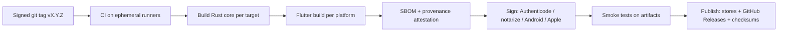

# 12 — Release and Distribution

## 1. Versioning
- Semantic versioning for the app (`MAJOR.MINOR.PATCH`); pre-1.0 uses `0.x` with alpha/beta tags.
- **Format versions** (vault header, envelope, snapshot) are versioned separately and documented in doc 04; readers stay backward compatible forever, writers upgrade only on explicit user action.
- Changelog per release; security fixes labelled.

## 2. Channels
| Channel | Audience | Cadence |
|---|---|---|
| Nightly | Maintainers/CI | Daily |
| Alpha/Beta | Testers (TestFlight, Play internal/closed, GitHub prerelease) | Per milestone |
| Stable | Everyone | When release gates (doc 11 §12) pass |

## 3. Per-platform distribution

| Platform | Artifact | Signing | Store / channel |
|---|---|---|---|
| Windows | MSIX + MSI/EXE installer | Authenticode code-signing (EV cert or Azure Trusted Signing) | Microsoft Store (optional), GitHub Releases, winget |
| macOS | Universal `.app` in notarized `.dmg` | Developer ID + notarization + hardened runtime | Mac App Store (optional), Homebrew cask, GitHub Releases |
| Linux | Flatpak, AppImage, `.deb`, `.rpm` | GPG/minisign signed checksums; Flathub review | Flathub, GitHub Releases, distro repos later |
| Android | AAB (Play) + signed APK | Play App Signing; separate upload key; APK signature published | Google Play, F-Droid (reproducible build goal), GitHub Releases |
| iOS | IPA | Apple distribution cert | App Store (TestFlight for betas) |

Accounts and costs: Apple Developer Program $99/yr; Google Play $25 one-time; code-signing certificate (Windows) ≈ $100–400/yr or Azure Trusted Signing subscription; domain for site and security contact.

## 4. Store-compliance notes
- **Apple:** privacy label "Data Not Collected"; encryption export compliance (uses standard encryption — typically exempt, `ITSAppUsesNonExemptEncryption` handling; confirm annually); iCloud/CloudKit entitlements; AutoFill credential-provider entitlement; no private APIs; Face ID usage string.
- **Google Play:** Data Safety form "No data collected/shared"; AutofillService declaration; sensitive-permission justifications; target API level policy; QUERY_ALL_PACKAGES avoided.
- **Microsoft Store:** MSIX identity, capability declarations minimal.
- Legal pages: privacy policy ("we collect nothing"), license notices (third-party licenses screen generated by tooling).

## 5. Build and release pipeline

- Release keys held in HSM/hardware tokens or CI-managed secure signing services; no long-lived private keys on developer laptops; two-person approval on release environment.
- Publish SHA-256 checksums + detached signatures (minisign/GPG); publish signing key fingerprints in README and site.
- **Reproducibility:** pin toolchains (Rust, Flutter, NDK, Xcode); `--locked` builds; goal is bit-for-bit reproducible Rust core and Android build (needed for F-Droid and trust).
- Generate SBOM (CycloneDX) per release.

## 6. Updates
- Stores handle mobile updates. Desktop: Microsoft Store/winget/Homebrew/Flatpak for managed updates.
- Optional in-app **update check** (off by default; opt-in; fetches a signed manifest over HTTPS; never auto-installs; verifies signature). No telemetry piggybacking.
- Minimum supported format-version enforced: if cloud data is from a **newer** format than the app understands, the app enters read-only/“update required” mode instead of risking corruption.

## 7. Migration and rollback safety
- Before any local DB migration: automatic local backup copy (encrypted) retained for 14 days.
- Downgrade: not supported after format upgrade; blocked with clear message.
- Staged rollout on Play/App Store (5% → 25% → 100%), halt on data-loss reports.

## 8. Vulnerability response
- Triage per SECURITY.md SLA; CVE request for confirmed issues; coordinated disclosure; patch release within defined timelines (critical ≤7 days target).
- Public security advisories on the repository; users notified through release notes and (opt-in) update check.

## 9. Documentation and support deliverables
- User guide (setup, recovery key, sync, restore, troubleshooting), FAQ on iCloud limits, “How we protect your data” explainer (from docs 03/04), audit report, build-from-source guide, contributor guide.
- Support channel: GitHub Discussions/issues; never ask users for vault files or passwords.

## 10. Launch checklist (1.0)
- [ ] All MUST requirements in doc 08 verified
- [ ] External audit published; fixes shipped
- [ ] Signed installers/AAB/IPA validated on clean machines
- [ ] Store listings, screenshots, privacy forms complete
- [ ] SECURITY.md and security contact tested
- [ ] Recovery-key onboarding usability results acceptable
- [ ] Backup/restore drill performed from cloud-only on a fresh device
- [ ] Docs, license notices, and SBOM published
